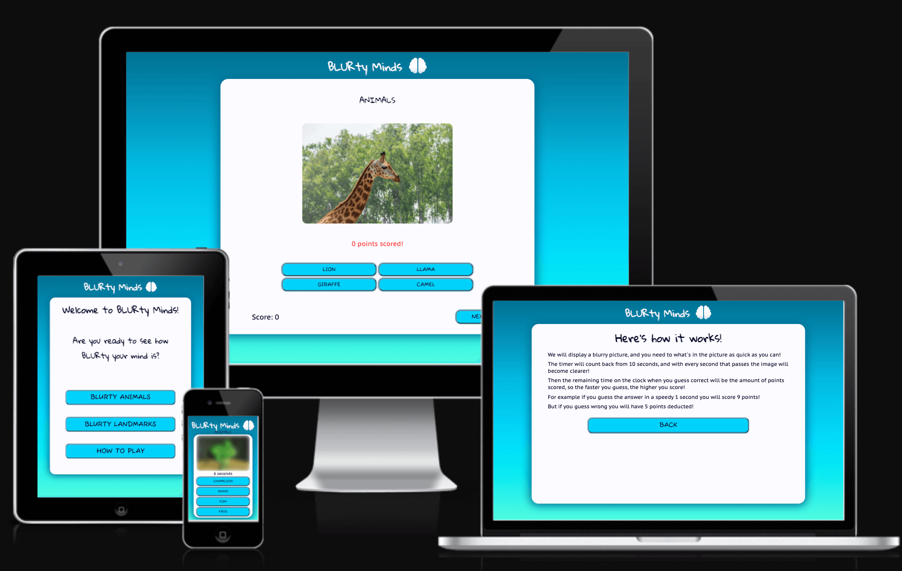

# BLURty Minds

[Click here to view the live project](https://lunartechfreek.github.io/blurty-minds/)

## Introduction

BLURty Minds is a game made for educational purposes for my second portfolio project in software development that I am studying with the Code Institute. This is a challenging game that is aimed for people who want to have some fun and challenge themselves. 

While designing this game I wanted to make it fun but challenging at the same time. I wanted to encourage users to return and play it multiple times so I made two separate sets of questions which vary in difficulty. I also included a lot more questions than the ones initially displayed so users would keep returning to play again. 

I have applied the the technologies I have learnt so far and used HTML5, CSS3 and Javascript to create my game. Other technologies used are listed in the technologies used section further down the page.