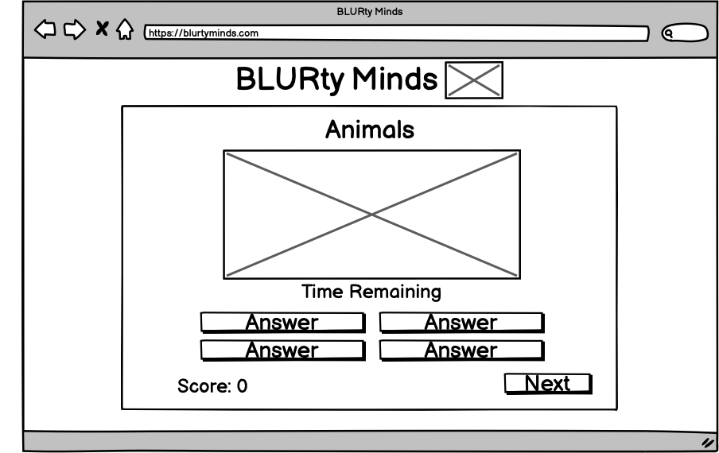

# BLURty Minds

[Click here to view the live project](https://lunartechfreek.github.io/blurty-minds/)

## Introduction

BLURty Minds is a game made for educational purposes for my second portfolio project in software development that I am studying with the Code Institute. This is a challenging game that is aimed for people who want to have some fun and challenge themselves. 

While designing this game I wanted to make it fun but challenging at the same time. I wanted to encourage users to return and play it multiple times so I made two separate sets of questions which vary in difficulty. The game consists of an image that is initially very blurry. Their are four pre-set answer buttons underneath the image and user has 10 seconds to guess what the image is. With every second that passes the image becomes less blurry. To encourage the user to guess the image in a speedy manner, I have designed it so they score more points the faster they answer. If they get an answer wrong they will have five points deducted. The game consists of ten questions but there are more questions available than that for each game. These are shuffled every time to show a random question and encourage the user to return and play again. 

I have applied the the technologies I have learnt so far and used HTML5, CSS3 and Javascript to create my game. Other technologies used are listed in the technologies used section further down the page.

## UX

I wanted to design a game that would be displayed clearly on the index page with a clear home section that is easy to navigate. I want to allow for easy navigation to clearly display the different games available and also the how to play section. Once playing I want to set out the game in a way that clearly displays relevant information such as the current game the user is playing and clearly display relevant information such as time remaining, score etc. At the end of the game I wanted to display the users score with a replay button and also a home button for easy navigation back to the home page to change the game.

I wanted to have all of this featured inside the game box to make it clear that throughout the user experience every choice they make is in regards to the game itself. To achieve this I made four sections which are hidden and made visible as the user navigates through the game. Through the use of Javascript enabling me to do this, the game only required one page. 

### Colour Scheme

#### Main Colour Palette

I used [Coolers](https://coolors.co/) to design my main colour palette. I first found a nice vibrant sky blue that I wanted to use as my main colour. I then used the colour generator on the [Coolers](https://coolors.co/) website to help generate other colours that complimented my main chosen colour.

I  chose for my colour scheme to be mainly a selection of blues but with a vibrant aquamarine colour being used to compliment them. I chose these colours to engage the user and to portray a positive emotion that is pleasing to the eye. 

I used a gradient for the background of the page for a nice effect that is pleasing for the users experience. I also did this because I feel the bright colours portray the fun playful side of the game, but I also used a darker cerulean blue which portrays a more serious tone. I feel this is very useful in subconsciously saying to the user this is fun game, but also one that is challenging you to test your brain. 

For the background of the game box I used a ghost white to break up the colours so as to not bombard the user with a visual overload. I also did this to differentiate between the colourful background of the page and the features of the game. I feel this makes the game very clear and helps the user easily identify different elements of the game at first glance.

I wanted to stick with the theme of blue so also used a very dark Oxford blue for the font colour. 

The colours used in my main colour palette are:

* #FCFBFF - Ghost White
* #00D2FC - Aquamarine
* #4FFBDF - Vivid Sky Blue
* #007193 - Cerulean
* #000022 - Oxford Blue 

#### Other Colours

I again used [Coolers](https://coolors.co/) to help me achieve this. I started by running the generator until I found a nice green colour. I then removed all of the other of the five default colours so I was left with only two. I then locked in the green and ran the generator until I found a nice red colour than was a good contrast to my chosen green. 

The colours I chose were:

* #OAE240 - Malachite
* #FF3030 - Vermillion

#### Contrast Grid

I used [Contrast Grid Eight Shapes](https://contrast-grid.eightshapes.com/?version=1.1.0&background-colors=&foreground-colors=%23FCFBFF%20%0D%0A%2300D2FC%0D%0A%234FFBDF%0D%0A%23007193%20%0D%0A%23000022%20%0D%0A%230AE240%0D%0A%23FF3030&es-color-form__tile-size=compact&es-color-form__show-contrast=aaa&es-color-form__show-contrast=aa&es-color-form__show-contrast=aa18&es-color-form__show-contrast=dnp) to check all of my colours for accessibility against each other. I included my correct and incorrect colours in this also. 

### Typography

I used [Google Fonts](https://fonts.google.com/) for the fonts throughout the site. To find fonts that pair well together I used [Font Joy](https://fontjoy.com/) which is a font generator where I entered my initial chosen font and it generates fonts that compliment it. 

I chose to use [Gloria Hallelujah](https://fonts.google.com/specimen/Gloria+Hallelujah?query=gloria) for the font of my main heading and also other headings. I chose this font because I feel it is almost like a child’s handwriting, and is very fun and playful and sets the tone that this is a fun game to play. 

I chose to use [Fuzzy Bubbles](https://fonts.google.com/specimen/Fuzzy+Bubbles?query=fuzz) as the font to be displayed on the buttons. I feel that this font is very similar to Gloria Hallelujah but is a lot clearer to read. I decided this would be best used on the buttons as to make the users experience easier while selecting answers and to avoid any difficulty in reading the answer buttons in a fast manner to get the highest score possible. 

I chose to use [Pt Sans Caption](https://fonts.google.com/specimen/PT+Sans+Caption?query=pt+sans+c) as the font for the how to section because there was going to be a lot of text there and I wanted it to be easy to take in the information without a distracting font such as the others used. I also used this font for my score and timer text for the same reason. 

I used a backup font of Sans-Serif incase there was a problem loading the other fonts.

## User Stories

### New Site Users

- As a new site user, I would like to play a game, so that I can relax.
- As a new site user, I would like to see vibrant colours, so that I can feel positive emotions while playing.
- As a new site user, I would like to easily navigate the site, so that I can easily play the game I chose.
- As a new site user, I would like to see the rules, so that I can understand how the game works.
- As a new site user, I would like to challenge myself, so that I can feel productive.
- As a new site user, I would like to have different game types, so that I can won't finish the game too fast.
- As a new site user, I would like to see if my answer is correct or not, so that I can clearly see how I am doing.

### Returning Site Users

- As a returning site user, I would like to easily navigate the site, so that I can replay the game or select a different one.
- As a returning site user, I would like to challenge myself, so that I can feel productive.
- As a returning site user, I would like to see my score, so that I can see if im improving.
- As a returning site user, I would like to have alot of questions, so that I can replay the game without too many repeated questions.

## Wireframes

To follow best practice, wireframes were developed for mobile, tablet, and desktop sizes.
I've used [Balsamiq](https://balsamiq.com/wireframes) to design my site wireframes.

### Mobile Wireframes

 Click here to see the Mobile Wireframes 

Welcome
  - 

How To
  - 

Question Area
  - 

Game End
  - 

### Tablet Wireframes

 Click here to see the Tablet Wireframes 

Welcome
  - 

How To
  - 

Question Area
  - 

Game End
  - 

### Desktop Wireframes

 Click here to see the Desktop Wireframes 

Welcome
  - 

How To
  - 

Question Area
  - 

Game End
  - 

## Features

### Existing Features

- **Game Box**

    - I wanted to make the site for the game as simple as possible. I felt the best way to do this would be to have only one page for the site. To make this work I created my game box on the page and then I used javascript to make this box function in a way that the user never feels the need to leave the box or the page. I used javascript to create three main sections to my game, and then hide and display the correct sections dependant on the event listeners that are triggered.  This also adheres to the user story regarding easy site navigation. 

- **Logo**

    - I wanted to make the home page easily accessible at all times so chose to make the logo at the top of the page a constant throughout the game but also to be a link to the home page to refresh the page and go back to the welcome section at the start no matter what is happening inside the game box. This allows the user to easily navigate back to the start at all times. 

- **Selection Of Games**

    - I decided to add two different game types each with their own list of questions and answers to adhere to the returning user stories and encourage them to revisit the site to play the game again. As well as the two game types I decided to add a lot more questions than is displayed to the user and used javascript to shuffle these questions so that the user will get a random set of questions each time the game is run.

- **Control Buttons**

    - To allow for easy site navigation I wanted there to be clear buttons displayed on the welcome section as soon as the page is loaded. This gives the user the options they require instantly without having to navigate their way to the game. It also gives the ability to load the users chosen game with one simple click so they can jump straight in. 

- **Hover Styles**

    - I wanted to enhance the users experience with the site on larger screens with a width above 992px. I did this by making it more interactive by adding a hover class to the control buttons. This changes the background colour of the button when it is hovered over. This shows the user clearly which option they are about to click on before they select it also. I also kept in mind my user stories and decided to use a vibrant colour to be displayed.

- **How To**

    - The how to section was designed inside of the game box and showcases the use of javascript through the use of hiding and displaying certain sections without the user having to leave the page. This also has a button to return to the home page and allows for easy navigation of the site. This section adheres to the user stories by giving the user an easy way to find the rules of the game and easily navigate back to the home section. 

- **Dynamic Game Title**

    - I have placed the title of the chosen game at the top of the game box. I have used javascript to create this as a dynamic element. This means that only the title of the game being played will be shown. The user will also find this feature very useful if they forget, as with the pictures being blurred throughout the game it will serve as a reminder as to what they are aiming to find in the picture. 

- **Blurred Image**

    - This is the main element of my game. I have added a blur effect to the picture, and with every second the image gets less blurry. I have done this through the use of javascript by reducing the blur effect with every second that passes by targeting the style in my code for my countdown.  

- **Show Full Image**

    - Another feature regarding the image is that when the user guesses the correct answer the whole image is shown to the user with no blur on it. I did this to almost reward and give the user the satisfaction after slowly watching blurring less with each second that passes. 

- **Timer**

    - Underneath the image I added a dynamic timer element. This timer counts down from 10 seconds live infront of the user while the game is running. I did this by using javascript and setting the inner HTML of the element.

- **Timer Font Colour Change**

    - I wanted to emphasise the fact that the countdown is nearly over when there is less than three seconds remaining on the timer. This was to to make the user realise they need to hurry up to pick an answer before they score no points. This was done by targeting the font colour within an `if` statement within my timer. 

- **Points Scored For Question**

    - When the user answered the question correctly I wanted to replace the timer feature with points scored, as the game will pause when the correct answer is chosen. I did that by using javascript and setting the inner HTML of the element to temporarily display the points scored until the next button is clicked. 

- **Answer Buttons**

    - I chose to have answer buttons rather than a text input box to make the users experience more enjoyable and to focus more on the game rather than checking spelling mistakes etc. I created a function that adds the answers from the array to the corresponding question. I also added code to shuffle where the answers are displayed every time they are displayed so the returning users won’t remember where they are. I also added a different hover class for the answer buttons so as to still display the correct and incorrect class colours. 

- **Correct/Incorrect Answer**

    - I added two different classes of correct and incorrect. One of these would be assigned as the background colour on the button depending on if the answer they chose was correct or not. I used javascript and the dataset feature to determine the correct answer and then add the class to the button which was clicked on. 

- **Correct/Incorrect Other Features**

    - I wanted to emphasise the correct and incorrect features even further to enable the user to clearly notice the games reaction to their answer selection. This also enhances the users experience by adding further interactivity to the game. I used javascript to add these features. I made a border around my game image that is normally hidden but as soon as the user clicks on an answer it will either turn red or green for a set period of time. 
    - As well as this I also added different behaviours from the buttons when they are clicked. If the answer is correct the button will pulse and grow. If the answer is incorrect the button will buzz further showing the user the reaction to their answer. 

- **Restart Button**

    - There is a restart button displayed at the bottom of the game at all times. I added this button so if the user wanted to start again they could click this button at any time. This further enhances the navigation of the game because with their being only one page I did not want the user to feel stuck once they were playing. 

- **Score**

    - I have added a score tally at the bottom of the page which keeps track of the users total score throughout the game. I added this feature so the user would know how well they were doing throughout the game at all times. I made this feature using javascript through use of functions that make the timer stop when the user clicks the correct answer. Whatever time is remaining is then taken as an integer and added to the score element.

- **Next Button**

    - I have featured a next button at the bottom of the page to go to the next question when the user has given a correct answer. I used javascript to add functionality to this button. I have made hidden until the correct answer is clicked so the user can not skip through the questions. I decided to add this button rather than automatically going the the next question because due to the nature of the game the user may want to inspect the picture further in their own time before moving on to the next question. 

- **Game End**

    - The game end section was designed inside of the game box and showcases the use of javascript through the use of hiding and displaying certain sections without the user having to leave the page. This also has a restart button and a home button so allows for easy navigation of the game. It also features the final score that the user scored. 

- **Final Score**

    - The final score is displayed on the game end section at the end of the game. The score is displayed through the use of javascript functions to take the score that was set in the total score section and also display in on this page with a different text to further emphasise to the user it is the end of the game. 

- **End Of Game Buttons**

    - I added the end of game buttons to add easy navigation for the user. With the game featuring solely on one page these buttons allow the user to either replay the same game type that they were just playing or return back to the welcome section to either change game type or possibly read the how to section. I used javascript to add functionality to these buttons. For the replay button I made the button check which game was being played and then adding the correct event listener to the button to either display the animals or landmarks questions. For the home button I used javascript to hide and display certain sections.

- **404 Page**

    - I added a 404 page to the website so that if I user enters the wrong address they will be redirected to the sites 404 page rather than the default browsers. I did this so that the user would realise that they are on the correct website and that they just tried to find a page the does not exist. I added a home button so the user could easily navigate their way back to the main site. 

### Future Features

In the future I plan to add more features to this game. These future developments would be as follows:

- **Different Game Types**
    - I would add different game types for a variety of different topics such as celebrities etc. 

- **Adults Only Game**
    - I would add an 18+ section of images that look like things they shouldn’t, but are innocent in reality. For this section I would require the users date of birth and use javascript to check they are old enough to enter this section. 

- **User Feedback**
    - I would add text to the game end section to give the user feedback on their score. To implement this by testing the game with many users and using the data I would determine what is a good, bad, and average score. The game would then check the users score and give the user feedback such as `"well done"` or `"better luck next time"` for example. 

- **Image Distortion**
    - I would add different ways to distort the image such as tiles that reduce by one with every second that passes for example. 

## Tools & Technologies Used

Throughout this project I have used a variety of different tools and technologies. These are listed below:

- [HTML](https://en.wikipedia.org/wiki/HTML) used for the main site content.
- [CSS](https://en.wikipedia.org/wiki/CSS) used for the main site design and layout.
- [CSS Flexbox](https://www.w3schools.com/css/css3_flexbox.asp) used for an enhanced responsive layout.
- [JavaScript](https://www.javascript.com) used for user interaction on the site.
- [Git](https://git-scm.com) used for version control. (`git add`, `git commit`, `git push`)
- [GitHub](https://github.com) used for secure online code storage.
- [GitHub Pages](https://pages.github.com) used for hosting the deployed front-end site.
- [Gitpod](https://gitpod.io) used as a cloud-based IDE for development.
- [Chrome DevTools](https://developer.chrome.com/docs/devtools/) used to check my responsive design and to run my lighthouse report. 
- [BrowserStack](https://www.browserstack.com/) used to emmulate different devices and browsers to test my website on.
- [Balsamiq](https://balsamiq.com/) used to create my wireframes. 
- [Google Fonts](https://fonts.google.com/) used to import my chosen fonts into my webpage. 
- [Am I Responsive?](https://ui.dev/amiresponsive) used to generate preview imagery of the responsive design used throughout the website.

## Testing

For all testing, please refer to the [TESTING.md](TESTING.md) file.

## Deployment

The site was deployed to GitHub Pages. The steps to deploy are as follows:

- In the [GitHub repository](https://github.com/lunartechfreek/blurty-minds), navigate to the Settings tab 
- From the source section drop-down menu, select the **Main** Branch, then click "Save".
- The page will be automatically refreshed with a detailed ribbon display to indicate the successful deployment.

The live link can be found [here](https://lunartechfreek.github.io/blurty-minds)

### Local Deployment

This project can be cloned or forked in order to make a local copy on your own system.

#### Cloning

You can clone the repository by following these steps:

1. Go to the [GitHub repository](https://github.com/lunartechfreek/blurty-minds) 
2. Locate the Code button above the list of files and click it 
3. Select if you prefer to clone using HTTPS, SSH, or GitHub CLI and click the copy button to copy the URL to your clipboard
4. Open Git Bash or Terminal
5. Change the current working directory to the one where you want the cloned directory
6. In your IDE Terminal, type the following command to clone my repository:
	- `git clone https://github.com/lunartechfreek/blurty-minds.git`
7. Press Enter to create your local clone.

Alternatively, if using Gitpod, you can click below to create your own workspace using this repository.

Please note that in order to directly open the project in Gitpod, you need to have the browser extension installed.
A tutorial on how to do that can be found [here](https://www.gitpod.io/docs/configure/user-settings/browser-extension).

#### Forking

By forking the GitHub Repository, we make a copy of the original repository on our GitHub account to view and/or make changes without affecting the original owner's repository.
You can fork this repository by using the following steps:

1. Log in to GitHub and locate the [GitHub Repository](https://github.com/lunartechfreek/blurty-minds)
2. At the top of the Repository (not top of page) just above the "Settings" Button on the menu, locate the "Fork" Button.
3. Once clicked, you should now have a copy of the original repository in your own GitHub account!

## Credits

I used various resources for content throughout the site. These are listed below in more detail. 

### Content

| Source | Location | Notes |
| --- | --- | --- |
| [Markdown Builder](https://tim.2bn.dev/markdown-builder) | README and TESTING | tool to help generate the Markdown files |
| [YouTube](https://www.youtube.com/watch?v=riDzcEQbX6k) | Game | Code to shuffle questions, code for displaying next question |
| [ChatGPT](https://chat.openai.com/auth/login) | Game | Code for displaying answers, starter code for timer before modified, used for some bug/syntax fixes |
| [Hover.Css](https://ianlunn.github.io/Hover/) | Game | Code taken for buzz and pulse grow button features |
| [W3Schools](https://www.w3schools.com/cssref/css3_pr_filter.php) | Game | How to blur the image |
| [W3Schools](https://www.w3schools.com/css/css3_transitions.asp) | Game | How to make the blur effect a smooth transition |
| [W3Schools](https://www.w3schools.com/java/java_foreach_loop.asp) | Game | Guidance for `forEach` loop |
| [W3Schools](https://www.w3schools.com/jsref/prop_text_placeholder.asp) | Game | Guidance for placeholder text |
| [W3Schools](https://www.w3schools.com/cssref/css3_pr_pointer-events.php) | Game | Guidance for pointer events to disable buttons |
| [W3Schools](https://www.w3schools.com/jsref/met_win_settimeout.asp) | Game | Guidance for setTimout function |
| [W3Schools](https://www.w3schools.com/cssref/pr_class_visibility.php) | Game | Guidance on visibility property |

