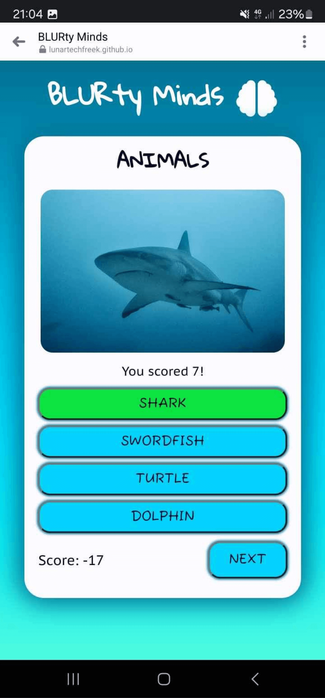
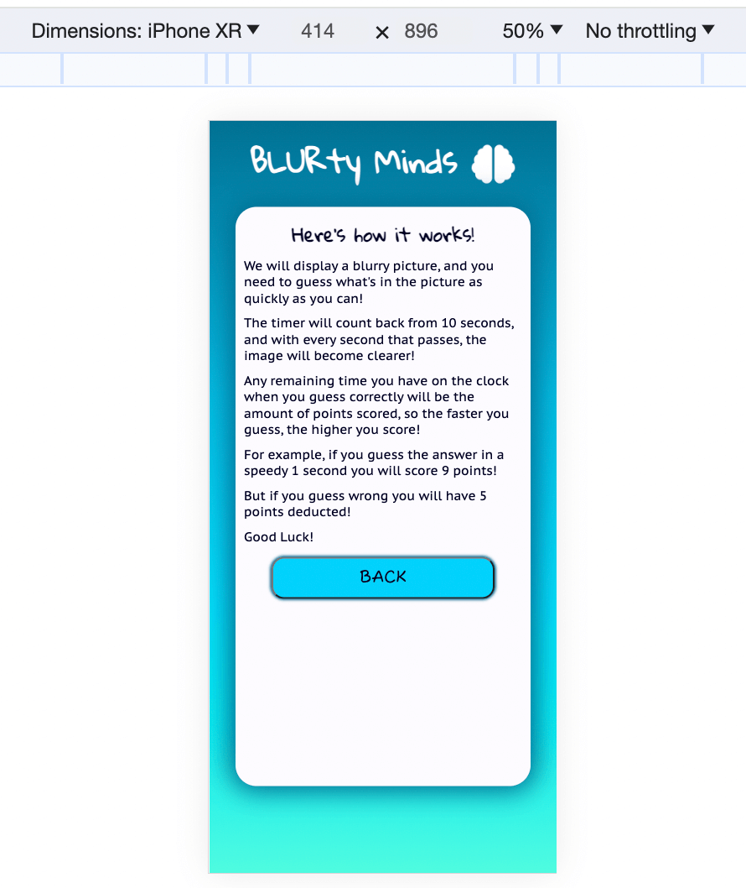
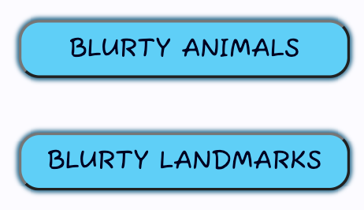
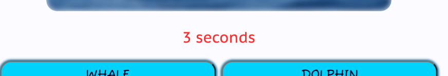
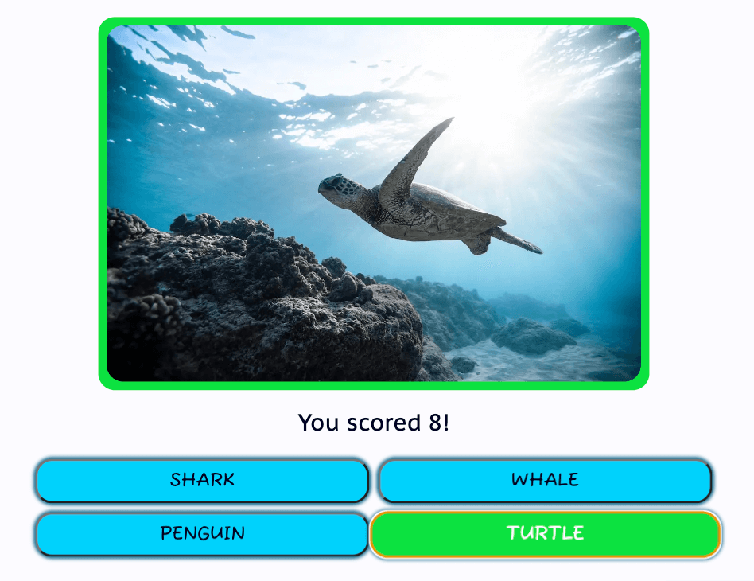

# Testing

Return back to the [README.md](README.md) file.

## Code Validation

### HTML

I have used the recommended [HTML W3C Validator](https://validator.w3.org) to validate all of my HTML files.

| Page | W3C URL | Screenshot | Notes |
| --- | --- | --- | --- |
| Home | [W3C](https://validator.w3.org/nu/?doc=https%3A%2F%2Flunartechfreek.github.io%2Fblurty-minds%2Findex.html) |  | Error: Empty heading warning |
| Home Fixed | [W3C](https://validator.w3.org/nu/?doc=https%3A%2F%2Flunartechfreek.github.io%2Fblurty-minds%2Findex.html) |  | Pass: Fixed previous warning |
| 404 | Generated by direct input |  | Pass: No Errors |

### CSS

I have used the recommended [CSS Jigsaw Validator](https://jigsaw.w3.org/css-validator) to validate all of my CSS files.

| File | Jigsaw URL | Screenshot | Notes |
| --- | --- | --- | --- |
| style.css | [Jigsaw](https://jigsaw.w3.org/css-validator/validator?uri=https%3A%2F%2Flunartechfreek.github.io%2Fblurty-minds) |  | Pass: No Errors |

### JavaScript

I have used the recommended [JShint Validator](https://jshint.com) to validate all of my JS files.

| File | Screenshot | Notes |
| --- | --- | --- |
| script.js |  | Error: Fixed by adding `/* jshint esversion: 11 */` to top of file  |
| script.js |  | Error: Fixed by adding semicolons |
| script.js |  | Error: Fixed by adjusting functions |
| script.js |  | Pass: Errors due to unused variables from external files |
| animals.js |  | Pass: Errors due to unused variables from external files |
| landmarks.js |  | Pass: Errors due to unused variables from external files |

## Manual Testing

I've tested my deployed project on multiple browsers to check for compatibility issues.

As well as testing on real world devices I wanted to test on other devices that I could not access. For this i used [BrowserStack](https://www.browserstack.com/). I tested the the website on various mobile and tablet devices, and also various mobile browsers on these devices. 

### Browser Testing

| Browser | Home | Notes |
| --- | --- | --- |
| Chrome |  | Works as expected |
| Edge |  | Works as expected |
| Firefox |  | Works as expected |
| Opera |  | Works as expected |
| Safari |  | Works as expected |

### Device Browser Testing

| Device | Browser | Home | Notes |
| --- | --- | --- | --- |
| Iphone 15 ProMax | Safari |  | Works as expected - Manual test |
| Iphone 13 ProMax | Safari |  | Works as expected |
| Iphone 12 Pro | Chrome |  | Works as expected |
| Samsung Galaxy S22 Ultra | Safari |  | Works as expected - Manual test |
| Google Pixel 8 Pro | Edge |  | Works as expected |
| Google Pixel 7 | Chrome |  | Works as expected |
| Huawei P30 | Chrome |  | Works as expected |
| Oneplus 9 | Firefox |  | Works as expected |
| Ipad 10th Gen | Safari |  | Works as expected |

## Responsiveness

I've tested my deployed project on multiple devices to check for responsiveness issues. Some of these were done with a manual test, others were done using either [BrowserStack](https://www.browserstack.com/) or [Chrome DevTools](https://developer.chrome.com/docs/devtools).

| Device | Home | Notes | Test |
| --- | --- | --- | --- |
| Iphone 15 ProMax |  | Works as expected | Manual test |
| Iphone 13 ProMax |  | Works as expected | Browserstack test |
| Iphone 12 Pro |  | Works as expected | Browserstack test |
| Iphone SE |  | Works as expected | Chrome DevTools test |
| Iphone XR |  | Works as expected | Chrome DevTools test |
| Samsung Galaxy S22 Ultra |  | Works as expected | Manual test |
| Google Pixel 8 Pro |  | Works as expected | Browserstack test |
| Google Pixel 7 |  | Works as expected | Browserstack test |
| Google Pixel 5 |  | Works as expected | Chrome DevTools test |
| Samsung Galaxy Fold |  | Works as expected | Chrome DevTools test |
| Samsung Galaxy S8+ |  | Works as expected | Chrome DevTools test |
| Samsung Galaxy S20 Ultra |  | Works as expected | Chrome DevTools test |
| Samsung Galaxy A51/71 |  | Works as expected | Chrome DevTools test |
| Samsung Galaxy A22 |  | Works as expected | Manual Test |
| Huawei P30 |  | Works as expected | Browserstack test |
| Oneplus 9 |  | Works as expected | Browserstack test |
| Ipad 10th Gen |  | Works as expected | Browserstack test |
| Ipad Air |  | Works as expected | Chrome DevTools test |
| Ipad Mini |  | Works as expected | Chrome DevTools test |
| Microsoft Surface Duo |  | Works as expected | Chrome DevTools test |
| Microsoft Surface Pro 7 |  | Works as expected | Chrome DevTools test |

## Lighthouse Audit

I've tested my deployed project using the Lighthouse Audit tool to check for any major issues. The results were as follows:

| Test | Home | Notes |
| --- | --- | --- |
| Mobile |  | No error messages |
| Desktop |  | No error messages |

## Defensive Programming

Defensive programming was manually tested with the below user acceptance testing:

| Feature | Expectation | Test | Result | Screenshot |
| --- | --- | --- | --- | --- |
| Game Box | Box to display on page load | Load page | Box displayed |  |
| Logo | Direct to home | Click logo | Directed to home page |  |
| Animals Control Button | Display animals questions | Click button | Animals Game Loaded |  |
| Landmarks Control Button | Display landmarks questions | Click button | Landmarks Game Loaded |  |
| How To Control Button | Display how to | Click button | How to Loaded |  |
| Hover | Hover styles to be applied | Hover mouse over button | Hover styles applied |  |
| Dynamic Game Title | Title to dynamically display current game type | Click relevent game button | Title of game displayed |  |
| Blurred Image | Image to reduce in blur every second | Run game | Image blur reduces on timer |  |
| Show Full Image | Image to have blur removed when correct answer selected | Answer question before timer gets to 0 | Blur removed |  |
| Timer | Timer to count back from 10 seconds on each question | Run questions | Timer functions correctly |  |
| Timer Font Colour Change | Timer font to change to red when there is less than 3 seconds remaining | Let timer run down past 3 seconds | Text changes colour |  |
| Points Scored Alert | Text to change from timer to a message displaying the amount of points scored when the correct answer is selected | Select correct answer | Points scored displayed |  |
| Answer Buttons | Button to display as correct or incorrect | Select answer | Button click returned as correct or incorrect |  |
| Correct Colour | Answer button to change to green when answer is correct | Click correct answer | Button displayed green |  |
| Incorrect Colour | Answer button to change to red when answer is incorrect | Click incorrect answer | Button displayed red |  |
| Correct Other Features | Border to turn green and button to pulse grow when answer is correct | Click correct answer | Border displayed as green and button grew |  |
| Incorrect Other Features | Border to turn red and button to buzz when answer is incorrect | Click incorrect answer |  |  |
| Restart Button | Button to take you back to the game selection page | Click restart button | Returned to game selection |  |
| Total Score | Total score to be displayed at the bottom | Play the game to build a score | Points added and displayed in total score |  |
| Next Button | To be displayed only when answer is correct and take the user to the next question | Select correct answer | Next button displayed and next question displayed when clicked |  |
| Game End | To be displayed when the user has got to the end of the game | Play the game until the end | Game end displayed |  |
| Final Game Score | Game score to be displayed on game end | Finish game | Score displayed as final score |  |
| Replay Button | Replay game that was being played | Click replay button | Current game restarted |  |
| Home Button | Return to welcome section | Click home button | Welcome section displayed |  |

## User Story Testing

| User Story | Screenshot |
| --- | --- |
| As a new site user, I would like to play a game, so that I can relax. |  |
| As a new site user, I would like to see vibrant colours, so that I can feel positive emotions while playing. |  |
| As a new site user, I would like to easily navigate the site, so that I can easily play the game I chose. |  |
| As a new site user, I would like to see the rules, so that I can understand how the game works. |  |
| As a new site user, I would like to challenge myself, so that I can feel productive. |  |
| As a new site user, I would like to have different game types, so that I can won't finish the game too fast. |  |
| As a new site user, I would like to see if my answer is correct or not, so that I can clearly see how I am doing. |  |
| As a returning site user, I would like to easily navigate the site, so that I can replay the game or select a different one. |  |
| As a returning site user, I would like to challenge myself, so that I can feel productive. |  |
| As a returning site user, I would like to see my score, so that I can see if im improving. |  |
| As a returning site user, I would like to have alot of questions, so that I can replay the game without too many repeated questions. |  |
| As a site administrator, I should be able to provide a fun and vibrant game, so that I can make the users have a happy experience. |  |
| As a site administrator, I should be able to provide mulitple games, so that I can encourage the user to return to play again. |  |
| As a site administrator, I should be able to provide more questions than are asked, so that I can get the user to return to play again. |  |

## Bugs

I encountered many bugs throughout my project, the most notable ones are as follows:

- Hide class not working as expected

    

    - To fix this, I moved my hide class to the bottom of my `.css` file.

- Button font colour displaying as blue.

    

    - To fix this, I added a specific font colour to my `.btn` class.

- How To section displaying incorrectly.

    

    - To fix this, I added a `min-height` declartion to game box on the stylesheet.

- Image blur distorting area outside of the image.

    

    - To fix this, I added the property `overflow: hidden;` to my stylesheet.

- Displayed the end text of the previous question for one second after displaying the new question.

    

    - To fix this, I added clear interval and the start countdown function to reset, I also added start countdown function to the run game function.

- Correct answer displaying incorrect class on button.

    

    - To fix this, I added `resetButtons()` to the check answer function.

- Timer trying to run multiple times after clicking replay button at game end.

    

    - To fix this, I updated the restartButton event listener.
